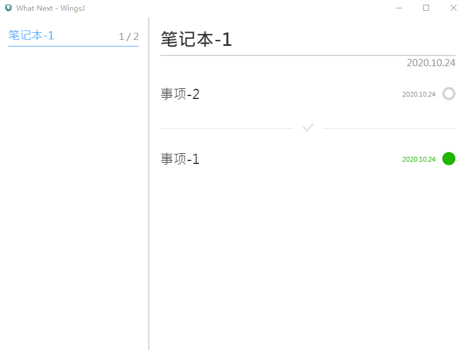

# 概述

事项清单。

## 功能

- 创建和删除事项。
- 列表展示事项，可分页。
- 完成和取消完成事项。
- 事项按页保存为 json 文件。

## 依赖

- Html，Css，Javascript
- Electron
- Vue

## 使用方法

1. 下载源码
2. 安装依赖：`npm install`
3. 控制台中运行：`npm run package-dir`
4. 在 code/release 可以看到打包后的程序
